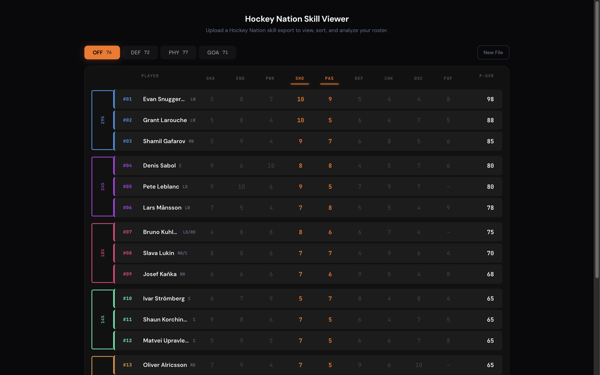
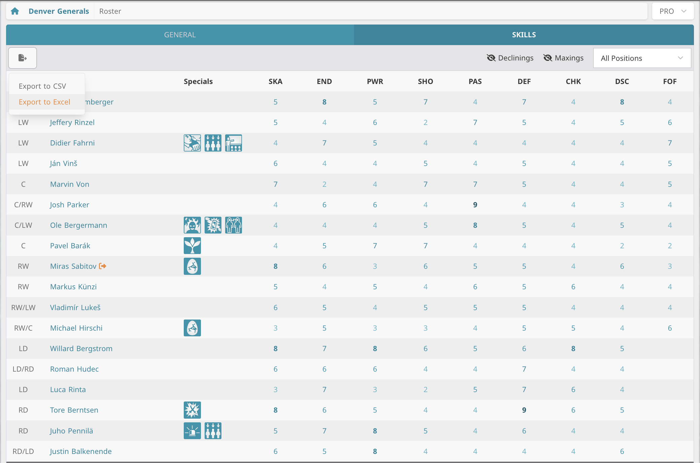

# HN Skill Viewer

**[→ Open HN Skill Viewer](https://mcsharland.github.io/hn-skill-viewer/)** · [Hockey Nation](https://hockey-nation.com)

## Usage

1. Go to your roster's **Skills** tab and hit **Export to XLS**
2. Drop the file into the viewer
3. Switch between OFF, PHY, DEF, and GOA tabs to see rankings

## Methodology

### Category skills

Each team rating category uses a specific subset of player skills to calculate a per-player OVR:

| Category | Skills used                                                                       |
| -------- | --------------------------------------------------------------------------------- |
| **OFF**  | Shooting, Passing                                                                 |
| **PHY**  | Power, Endurance, Skating                                                         |
| **DEF**  | Checking, Defending                                                               |
| **GOA**  | All goalie skills (Reflexes, Endurance, Positioning, Pads, Glove, Blocker, Stick) |

### Skater sorting & grouping

Players are ranked by their category OVR (calculated using the standard formula against only the relevant skills). The top 18 skaters are placed into 6 groups of 3, ordered by rank. Each group contributes to the team rating with a descending weight:

| Group | Players   | Weight |
| ----- | --------- | ------ |
| 1     | #1 – #3   | 29%    |
| 2     | #4 – #6   | 24%    |
| 3     | #7 – #9   | 18%    |
| 4     | #10 – #12 | 14%    |
| 5     | #13 – #15 | 10%    |
| 6     | #16 – #18 | 5%     |

The team rating is the weighted sum of each group's average OVR. If fewer than 18 skaters are on the roster, empty slots are filled with a base OVR of 25.

### Goaltending

GOA uses the same OVR formula but across all 7 goalie skills. Only 2 goalies count, the starter weighted at 80% and the backup at 20%. Missing slots default to 25.

### Bench

Players beyond the top 18 (or top 2 for goalies) are shown below the ranked groups. They don't affect the team rating but are still sorted and displayed for reference.
